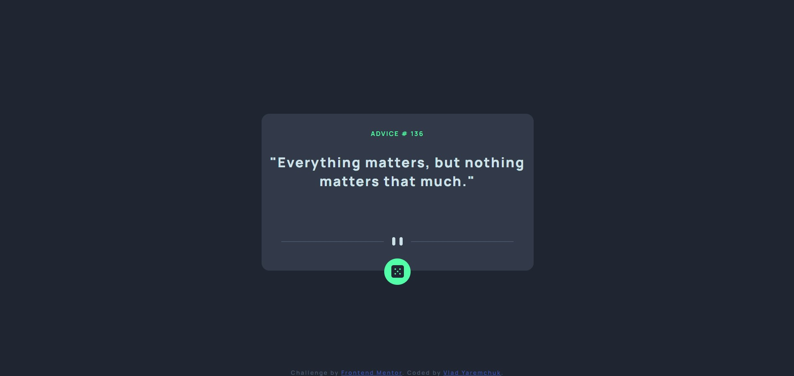

# Frontend Mentor - Advice generator app solution

This is a solution to the [Advice generator app challenge on Frontend Mentor](https://www.frontendmentor.io/challenges/advice-generator-app-QdUG-13db). Frontend Mentor challenges help you improve your coding skills by building realistic projects.

## Table of contents

- [Overview](#overview)
  - [The challenge](#the-challenge)
  - [Screenshot](#screenshot)
  - [Links](#links)
- [My process](#my-process)
  - [Built with](#built-with)
  - [What I learned](#what-i-learned)
  - [Continued development](#continued-development)

## Overview

### The challenge

Users should be able to:

- View the optimal layout for the app depending on their device's screen size
- See hover states for all interactive elements on the page
- Generate a new piece of advice by clicking the dice icon

### Screenshot



### Links

- Solution URL: https://github.com/Vladmidir/advice-generator-app
- Live Site URL: https://vladmidir.github.io/advice-generator-app/

## My process

### Built with

- Semantic HTML5 markup
- CSS custom properties

### What I learned

Learned how to access data from web APIs using javascript fetch.
```js
function giveAdvice(){
    slip = fetch("https://api.adviceslip.com/advice")
    .then(response => response.json() //.json() returns another promise
    .then(value => {
        document.getElementById("advice-id").innerText = value['slip']['id'];
        document.getElementById("advice-text").innerText = value['slip']['advice'];
    }));
}
```

Learned how to add "glow" on hover using CSS.
```css
.button-box:hover {
    box-shadow: 0 0 30px 5px hsl(150, 100%, 66%);
    /* in order: x offset, y offset, blur size, spread size, color */
    /* blur size and spread size are optional (they default to 0) */
}
```

### Continued development

In the future, I want to gain experience using more complex APIs. This is my 5th front-end project. For the next several projects, I want to focus on the backend. Particularly I want to learn to use APIs in the backend.
